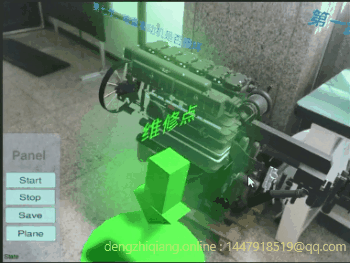
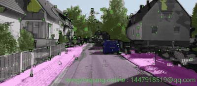

# 个人主页 for 沈优

## Demo展示：

<table rules="none" align="center">
	<tr>
          <td> AR维修任务1  </td>
          <td>
			

				
			

		</td>
	<tr>
          <td> AR维修任务2  </td>
          <td>
			

				
			

		</td>
	</tr>
	<tr>
          <td> AR维修任务3  </td>
          <td>
			

				
			

		</td>
        </tr>
	<tr>
          <td> AR维修任务4  </td>
          <td>
			

				
			

		</td>
	</tr>
	<tr>
          <td> AR辅助维系虚拟动画展示，在指定位置添加虚拟动画(发动机)，利用交互信息来辅助检查和维修  </td>
          <td> </td>
        </tr>
	<tr>
		<td>
			

				
			

		</td>
		<td>
		</td>
	</tr><tr>
          <td> kitti数据集上实例分割  </td>
          <td> kitti数据集上进行物体建模和语义重定位，图中蓝色关键帧和黄色关键帧来自两个机器人采集的数据，利用语义和几何结合的重定位技术实现地图拼接 </td>
        </tr>
	<tr>
		<td>
			

				
			

		</td>
		<td>
			

				
			

		</td>
	</tr>
</table>

### 论文《Object-Plane Co-Represented and Graph Propagation-Based Semantic Descriptor for Relocalization》 
论文摘要：   
Relocalization is a critical component of robotics applications, it poses challenges due to changes in lighting conditions, weather, and viewing point. Image feature-based approaches are appearance-sensitive, high-level semantic landmark-based methods are ambiguous, and topological map matching-based methods are not robust enough among available solutions. We propose a highly robust and highly expressive semantic descriptor for graph matching. Specifically, we begin by introducing an object-plane co-represented topological graph and a graph propagation algorithm to formulate descriptors for high-level landmarks; we then solve graph matching using the sKM algorithm. Finally, we develop a relocalization system that combines semantic objects and geometric planes for pose optimization and conducts experimental validation on various datasets. Experimental results demonstrate that the suggested method remains effective even when the viewpoint changes by more than 80˚ on the 2D-3D-S dataset, and the mean orientation error is less than 5˚ on the sceneNN dataset.   
[论文链接](https://ieeexplore.ieee.org/document/9829918)
  
* 在大视差下使用语义拓扑图进行重定位的一个示例：   

  
  

