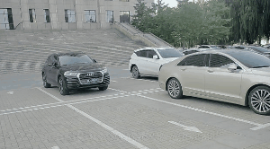
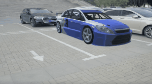
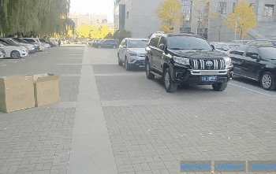
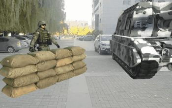
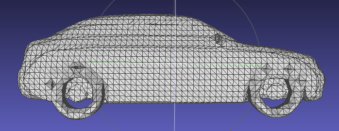
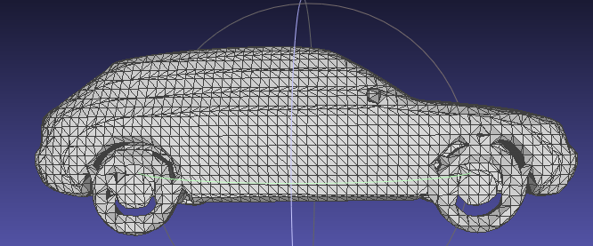
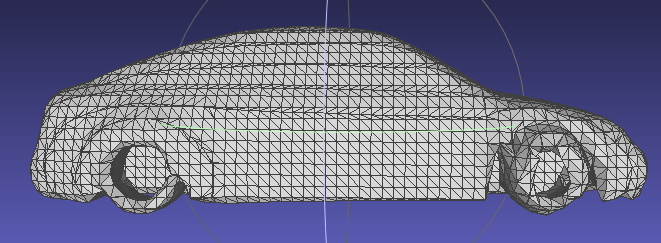
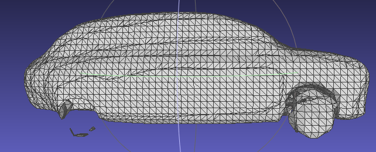
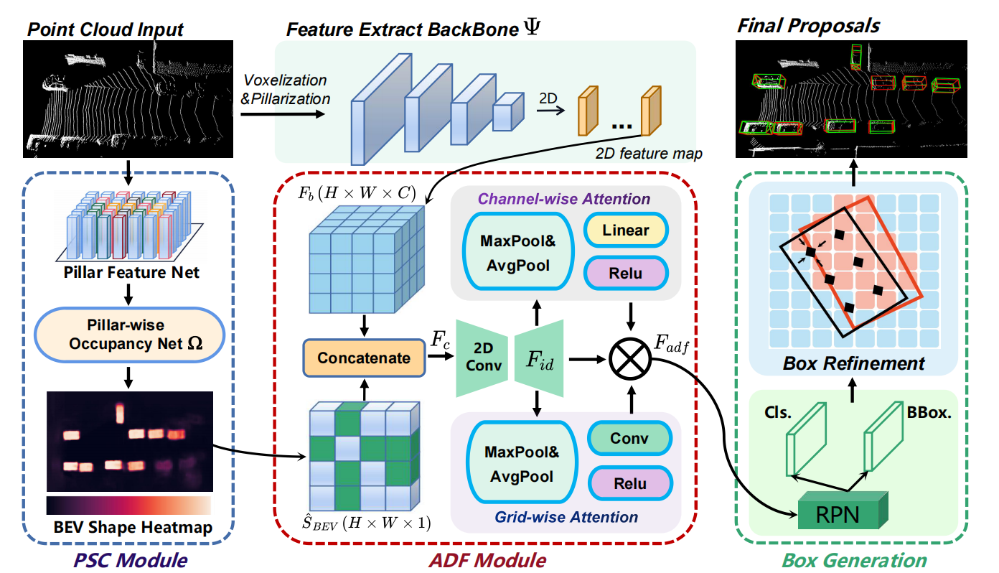

# 个人主页 to 沈优 

## 项目Demo：
### 项目1. 基于增强现实的船载电子装备辅助维修：
<table rules="none" align="center">
  <tbody>
    <tr>
      <td>
<b>任务1：工作台物体类别标注</b>
</td>
      <td>
<b>任务2：发动机维修细节指导</b>
</td>
    </tr>
    <tr>
      <td>
	

		
	

      </td>
      <td>
	

		
	
 
      </td>
    </tr>
    <tr>
      <td>
<b>任务3：分布式维修指导</b>
</td>
      <td>
<b>任务4：发动机内部结构展示</b>
</td>
    </tr>
    <tr>
      <td>
	

		
	

      </td>
      <td>
	

		
	
 
      </td>
    </tr>
  </tbody>
  <colgroup>
    <col>
    <col>
  </colgroup>
</table>
***

### 项目2. 基于增强现实的数字场景孪生：
<table rules="none" align="center">
	<tr>
          <td> 孪生场景1  </td>
          <td>
			

				
			

		</td>
	</tr>
	<tr>
		<td> 孪生场景2  </td>
          <td>
			

				
			

		</td>
	</tr>
	<tr>
          <td> AR演示原视频1  </td>
	  <td>
			

				
			

	  </td>
        </tr>
	<tr>
		<td> 虚实融合1(图中蓝车) </td>
		<td>
			

				
			

		</td>
	</tr>
	<tr>
          <td> AR演示原视频2  </td>
		<td>
			

				
			

		</td>
        </tr>
	<tr>
		<td> 虚实融合2(图中坦克和虚拟士兵) </td>
		<td>
			

				
			

		</td>
	</tr>
	
</table>

### 项目3. 基于隐式编码的物体模型优化：
<table rules="none" align="center">
	<tr>
          <td> 原始描述子 </td>
          <td>
			

				
			

		</td>
		<td> 正态分布0.05  </td>
          <td>
			

				
			

		</td>
	</tr>
	<tr>
          <td> 正态分布0.1  </td>
          <td>
			

				
			

		</td>
		<td> 正态分布0.2  </td>
          <td>
			

				
			

		</td>
	</tr>
</table>

## 论文[IROS-2023]《BSH-Det3D: Improving 3D Object Detection with BEV Shape Heatmap》 

[论文链接](https://arxiv.org/abs/2303.02000)

[CODE](https://github.com/mystorm16/BSH-Det3D)

**摘要：**   
The progress of LiDAR-based 3D object detection has significantly enhanced developments in autonomous driving and robotics. However, due to the limitations of LiDAR sensors, object shapes suffer from deterioration in occluded and distant areas, which creates a fundamental challenge to 3D perception. Existing methods estimate specific 3D shapes and achieve remarkable performance. However, these methods rely on extensive computation and memory, causing imbalances between accuracy and real-time performance. To tackle this challenge, we propose a novel LiDAR-based 3D object detection model named BSH-Det3D, which applies an effective way to enhance spatial features by estimating complete shapes from a bird's eye view (BEV). Specifically, we design the Pillar-based Shape Completion (PSC) module to predict the probability of occupancy whether a pillar contains object shapes. The PSC module generates a BEV shape heatmap for each scene. After integrating with heatmaps, BSH-Det3D can provide additional information in shape deterioration areas and generate high-quality 3D proposals. We also design an attention-based densification fusion module (ADF) to adaptively associate the sparse features with heatmaps and raw points. The ADF module integrates the advantages of points and shapes knowledge with negligible overheads. Extensive experiments on the KITTI benchmark achieve state-of-the-art (SOTA) performance in terms of accuracy and speed, demonstrating the efficiency and flexibility of BSH-Det3D. The source code is available on https://github.com/mystorm16/BSH-Det3D.

	

<iframe src="//player.bilibili.com/player.html?aid=440561988&bvid=BV16L41117ND&cid=1042208652&page=1" scrolling="no" border="0" frameborder="no" framespacing="0" allowfullscreen="true"> </iframe> 
